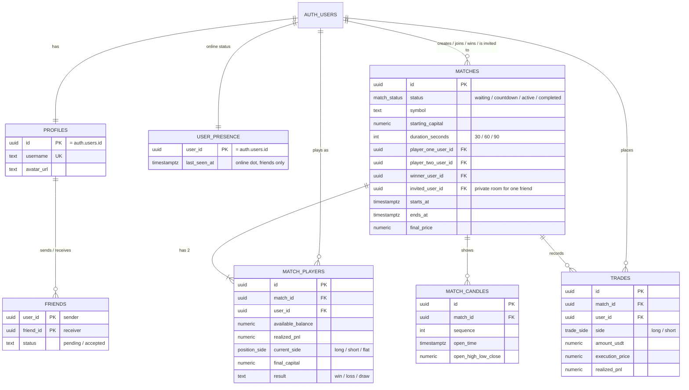

*This project has been created as part of the 42 curriculum by bryeap, zernest, rvikrama, ayeap.*

# DUEL — 1v1 Crypto Trading

## Description

**DUEL** is a head-to-head **simulated** Bitcoin trading game. Two players join the same match, watch the same live BTC-USD candle feed, and open long/short positions with virtual capital. The match creator picks the trading window (30, 60 or 90 seconds) and the starting capital (5K, 10K or 20K USDT). After a 10-second countdown and that trading window, the player who finishes with the most capital wins. No real money is involved.

The goal of the project was to build a complete, multi-user, real-time web application: a frontend, a backend, a database, live gameplay between two remote players, and the account features around it (profiles, friends, stats and security).

### Key features

- **Live 1v1 trading matches**: both players see the same real BTC candles, streamed by our own Socket.IO match engine
- **Server-side trading**: every order is checked on the server, positions and PnL are tracked, and the match is settled fairly
- **Lobby**: create a match, join an open one, invite a friend to a private one, and rejoin a match you left
- **Game customization**: the match creator picks the match length (30s / 1 min / 1.5 min), the starting capital (5K / 10K / 20K USDT), a room name, and whether anyone or only one friend can join. Leaving everything as it is gives the standard game (1 min, 10K, public room).
- **Accounts**: email/password sign-up, Google sign-in (OAuth 2.0) and TOTP two-factor authentication
- **Profiles**: avatar upload (with a default avatar), stats, win rate, trader tier and achievements
- **Friends**: find players by username and send them a request, accept requests, see which friends are online, and challenge a friend to a private match
- **Leaderboard and match history**, with a detailed page for each past match
- **3 languages**: English, Bahasa Melayu and Simplified Chinese
- **Monitoring**: OpenTelemetry → Prometheus → Grafana, with dashboards and email alerts
- **Privacy Policy, Terms of Service and a How-to-Play page**

## Team Information

| Member | Login | Role(s) | Responsibilities |
| --- | --- | --- | --- |
| Brian Yeap | `bryeap` | **Product Owner**, Project Manager, Developer | Set the product vision and priorities, and decided what goes into each sprint. Ran an AI "PM bot" that kept the task board up to date. Built the realtime socket server and match logic. |
| Raja Vikraman | `rvikrama` | **Project Manager**, Developer | Organised the team, tracked progress and deadlines, and followed up on blockers. Built the profile, history and settings pages and most of the shared UI components. |
| Zernest (zep) | `zernest` | **Tech Lead / Architect**, Developer | Owned the technical decisions: the Supabase setup, auth, database security (RLS) and how the frontend talks to the backend. Built the i18n system, the leaderboard and achievements. |
| Amber Yeap | `ayeap` | Developer | Built the match lifecycle screens (waiting room, countdown, live match, results), the monitoring stack, the legal pages and the How-to-Play page. |

Brian and Raja shared the Project Manager role. Brian handled the planning side: what goes into each sprint and keeping the task board up to date with the PM bot. Raja handled the follow-up side: tracking deadlines, checking on progress and chasing blockers.

All four of us worked as developers, reviewed each other's changes and tested our own features.

## Project Management

- **How we split the work:** the project was cut into features (auth, lobby, match engine, match UI, profile, friends, monitoring, i18n…). Each feature had one main owner, and people helped each other when blocked. The PRD, sprint plans and architecture notes live in [`docs/`](docs/).
- **Tracking:** a **Notion** board held the status of every task (what's being worked on, blockers, notes). Brian's AI PM bot helped keep it in sync with the repo.
- **Meetings:** regular team meetups to plan the next steps, demo progress and unblock each other.
- **Communication:** **WhatsApp** for day-to-day chat, and **Google Meet** and **Discord** calls for meetings and pair debugging.
- **Code:** Git with feature branches. Everyone committed their own work.

## Technical Stack

| Layer | Technology | Why we chose it |
| --- | --- | --- |
| Frontend | **Next.js 16** (App Router), **React 19**, **TypeScript**, **Tailwind CSS 4** | Next.js gives us routing, server components (SSR) and API route handlers in one framework. TypeScript catches mistakes early. Tailwind makes styling fast and consistent. |
| Charts | **lightweight-charts** (TradingView) | Built for candlestick charts, small, and fast enough for live updates |
| Backend (web) | **Next.js route handlers** (`app/api/…`) | Room creation, joining a match, avatar uploads and security settings run on the server, next to the UI code |
| Backend (realtime) | **Node.js 22** + **Socket.IO 4** (`socket/`) | A match is a long-running process with state in memory (candles, positions, timers). Socket.IO handles rooms, broadcasting and reconnecting. |
| Database | **Supabase (PostgreSQL)** | A real relational database with foreign keys, enums and Row Level Security. It also comes with Auth (email/password, OAuth, MFA) and Storage (avatars), so we didn't have to build those ourselves. |
| Auth | **Supabase Auth** | Salted, hashed passwords, Google OAuth and TOTP 2FA out of the box |
| Market data | **Coinbase Exchange API** (BTC-USD candles) | Free, public, real price data with no API key needed |
| i18n | **next-intl** | Works with Next.js server and client components |
| Monitoring | **OpenTelemetry**, **Prometheus**, **Grafana** | OTel is the standard way to export metrics. Prometheus stores them, and Grafana shows dashboards and sends alerts. |
| Containers | **Docker** + **Docker Compose** | The whole stack starts with one command |
| Hosting | **Vercel** (web app) | Free, and made for Next.js |

### Architecture

| Part | Where | What it does |
| --- | --- | --- |
| Web app | `app/`, `lib/` | Next.js (App Router) UI: login, lobby, match screen, profile, friends, leaderboard, history, settings |
| Match engine | `socket/` | Node + Socket.IO server on port `4000`. Runs live matches, fetches Coinbase BTC-USD candles, validates trades, saves results |
| Database / auth | `supabase/` | Supabase Postgres, Auth (email/password, Google OAuth, TOTP 2FA) and Storage (avatars) |
| Monitoring | `monitoring/` | OpenTelemetry collector → Prometheus → Grafana |
| Translations | `messages/` | `en`, `ms`, `zh-CN` via `next-intl` |

More detail, with diagrams: [How DUEL works](docs/architecture.md).

## Database Schema

The database is Supabase PostgreSQL. The full schema, including RLS policies and functions, is in [`supabase/schema.sql`](supabase/schema.sql). A diagram-friendly version is in [`supabase/schema.dbml`](supabase/schema.dbml): paste it into [dbdiagram.io](https://dbdiagram.io) to see it drawn.



| Table | Purpose |
| --- | --- |
| `profiles` | One row per player: username and avatar. Created automatically on sign-up by the `handle_new_user()` trigger (this also covers Google sign-ups). No email here: emails stay in Supabase's private `auth.users` table. |
| `user_presence` | When each player was last online (`last_seen_at`), updated by `ping_online()`. Only the player and their accepted friends can read it. |
| `friends` | Friend requests and friendships. A unique index allows only one row per pair of players. |
| `matches` | One row per 1v1 match: status, timing, capital, players, winner. `invited_user_id` makes it a private room that only that one friend can see and join. |
| `match_players` | Each player's state inside a match: balance, open position, PnL, final result |
| `match_candles` | The candles shown during a match, so a match can be replayed and a rejoining player sees the same chart |
| `trades` | Every order a player placed, with the price and the position after it |
| `friends_with_status` (view) | The logged-in user's friends and requests, joined with their profile and online status (`security_invoker`, so RLS still applies) |

How friend requests, online status and private invites work, with diagrams: [How friends work](docs/friends.md).

Row Level Security is on for every table. Players can only change their own data, online status is only shared with accepted friends, private rooms are only visible to the invited friend, and only the match engine (using the service-role key) can write match results.

## Features List

| Feature | Description | Built by |
| --- | --- | --- |
| Initial UI, layout and login screens | App shell, side navigation, the login and sign-up forms | Brian |
| Authentication (Supabase) | Email/password, Google OAuth, TOTP 2FA, protected routes | Zep |
| Row Level Security | Database policies so players only see and change what they're allowed to | Zep |
| Match engine (sockets) | Socket.IO server: rooms, candle streaming, order validation, PnL, settlement, stale-match cleanup, rejoin | Brian |
| Frontend ↔ backend connection | Connecting the UI to Supabase and the socket server | Zep, Brian |
| Match lifecycle UI | Waiting room, countdown, live match page, results page | Amber |
| Create-match modal | The form for creating a match: room name, who can join (anyone or one friend), length (30 / 60 / 90 s) and starting capital (5K / 10K / 20K) | Amber |
| Game customization (server side) | `/api/rooms` checks the chosen length and capital against `lib/match/rules.ts` and saves them on the match. The match engine then runs the match for that length with that capital. | Brian |
| Friends | Search by username and send a request, accept and remove friends, an online status dot, and inviting a friend to a private match (with a pop-up for the invited friend) | Brian |
| Profile page | Stats, win/loss/draw bar, win rate, trader tier, avatar | Raja |
| Achievements | Unlocked from your match record (first win, 5 / 10 / 42 wins…), shown as animated custom badges | Zep, Raja |
| Match history | A list of past matches and a detail page for each one | Raja |
| Settings | Username, avatar upload (through a secure server route), 2FA settings | Raja |
| Shared components | Most of the reusable UI components | Raja |
| Leaderboard | Ranked by wins, then win rate, then games played, with a stable tie-breaker | Zep |
| Multi-language (i18n) | `en` / `ms` / `zh-CN` with next-intl and a language switcher | Zep (Amber helped add translations) |
| Monitoring | OpenTelemetry → Prometheus → Grafana, dashboards and alerts | Amber |
| Privacy Policy and Terms of Service | Legal pages, linked from the app | Amber |
| How-to-Play page | Game rules and a trading glossary | Amber |

## Modules

| # | Module | Type | Pts | Built by |
| --- | --- | --- | --- | --- |
| 1 | Web: Use a framework for both frontend and backend (Next.js) | Major | 2 | Everyone |
| 2 | Web: Real-time features using WebSockets | Major | 2 | Brian, Amber |
| 3 | Gaming: Complete web-based game | Major | 2 | Brian, Amber |
| 4 | Gaming: Remote players | Major | 2 | Brian |
| 5 | User Management: Standard user management and authentication | Major | 2 | Raja, Brian, Zep |
| 6 | DevOps: Monitoring system with Prometheus and Grafana | Major | 2 | Amber |
| 7 | Module of choice: Real-market trading engine | Major | 2 | Brian |
| 8 | User Management: Remote authentication with OAuth 2.0 (Google) | Minor | 1 | Zep |
| 9 | User Management: Two-Factor Authentication (2FA) | Minor | 1 | Zep |
| 10 | Accessibility: Support for multiple languages (3) | Minor | 1 | Zep, Amber |
| 11 | User Management: Game statistics and match history | Minor | 1 | Raja, Zep |
| 12 | Web: Server-Side Rendering (SSR) | Minor | 1 | Everyone |
| 13 | Web: File upload and management system | Minor | 1 | Raja |
| 14 | Gaming: Gamification system | Minor | 1 | Zep, Raja |
| 15 | Accessibility: Support for additional browsers | Minor | 1 | Everyone |
| 16 | Gaming: Game customization options | Minor | 1 | Amber, Brian |
| | **Total** | 7 Major + 9 Minor | **23** | (14 required) |

### How each module was implemented, and why we chose it

1. **Frameworks (Next.js).** Next.js is a full-stack framework, so we use both halves. The frontend is React pages in `app/`. The backend is route handlers in `app/api/` (`rooms`, `rooms/join`, `profile/avatar`, `user/security`) and the OAuth callback. We chose it so one codebase could hold both the UI and the server logic.
2. **Real-time (WebSockets).** `socket/server.js` is a Socket.IO server. Each match is a room. Candles, trades, balances and match status are broadcast to both players as they happen. When a player disconnects, the client shows a connection banner and reconnects automatically. A trading duel only works if both players see the same price at the same moment, so we needed this.
3. **Web-based game.** DUEL is the game. It has clear rules (same capital, same candles, and a trading window of 30, 60 or 90 seconds) and a clear winner (the most capital at the end, or a draw). Rules are on the How-to-Play page.
4. **Remote players.** Two players on different computers play the same match live. The server is the only source of truth, so every trade is checked there. If a player drops out, they can **rejoin** from the lobby. Saved candles are loaded from the database so their chart continues exactly where the match is.
5. **Standard user management.** Players can edit their profile and upload an avatar (with a default if they don't), add friends by username and see their online status (`ping_online()` updates `user_presence.last_seen_at`), and view a profile page with their stats.
6. **Prometheus and Grafana.** The web app and the socket server export metrics through OpenTelemetry to an OTel collector. Prometheus scrapes them and has alerting rules. Grafana has our custom dashboards and sends alerts by email, and it's protected by an admin login over HTTPS. Everything is set up in `monitoring/`.
7. **Module of choice: real-market trading engine (Major).**
   - *Why we chose it:* the whole game depends on it. It isn't covered by any listed module, because the "web-based game" module covers rules and win/loss, not a trading simulator running on live market data.
   - *Technical challenges:*
     - fetching and normalising real Coinbase BTC-USD candles
     - streaming them in sync to both players
     - checking long/short orders on the server
     - tracking net positions, average entry price, and realised and unrealised PnL
     - settling the match at the final price
     - saving candles and trades so matches can be replayed and rejoined
     - cleaning up stale matches with `closeStaleMatches`
   - *Value:* the game uses real market movement instead of random numbers, so skill actually matters, and cheating from the browser isn't possible.
   - *Why Major:* it's a complete server-side subsystem with its own state machine, maths (`socket/engine-math.js`) and persistence. It's about as much work as any other Major module.
8. **OAuth 2.0.** "Sign in with Google" through Supabase Auth. The redirect URL is set up in the Google Cloud project, and a database trigger creates the profile row for new Google users.
9. **2FA.** TOTP (authenticator app) through Supabase MFA. Players enrol from Settings, and have to pass `/auth/verify-mfa` when they log in.
10. **Multiple languages.** `next-intl` with `messages/en.json`, `ms.json` and `zh-CN.json`, plus a language switcher in the UI. All the text players see comes from the message files.
11. **Game statistics and match history.** Wins, losses, draws and win rate on the profile. A history list with a detail page for each match (trades and chart). A global leaderboard.
12. **SSR.** Most pages (home, lobby, leaderboard, profile, match and match detail) are React Server Components rendered on the server, and they load their data there before sending the HTML.
13. **File upload.** Avatars are checked on both sides: the client checks the file type, and the server caps the size and checks the real format from the file's magic bytes (JPEG, PNG, GIF, WebP or AVIF), so a faked file type is rejected. Every upload is decoded and re-encoded to a 256×256 JPEG, so whatever format goes in, what is stored and displayed is always a plain JPEG. The image is stored in a locked-down Supabase Storage bucket through `/api/profile/avatar`, and previewed in Settings.
14. **Gamification.** Achievements (first win, 5 / 10 / 42 wins, and more), badges (trader tier: beginner / amateur / pro) and a leaderboard. They're all calculated from match results saved in the database, and shown with visual feedback on the profile.
15. **Additional browsers.** Besides Chrome, the whole app was tested in **Microsoft Edge** and **Brave**: sign-up and login (including Google OAuth and 2FA), the lobby, live matches and rejoining, avatar upload, friends, the language switcher and the monitoring dashboards. Everything works and looks the same in all three. The only browser-specific difference we found is listed under [Known Limitations](#known-limitations).
16. **Game customization.** When creating a match, the creator chooses:
    - **Match length:** 30 seconds, 1 minute or 1.5 minutes. A short match rewards quick decisions, and a longer one gives the price more time to move.
    - **Starting capital:** 5K, 10K or 20K USDT. Both players always start with the same amount, so the match stays fair.
    - **Who can join:** anyone in the lobby, or one chosen friend (a private room only that friend can see).
    - **Room name:** optional. If left blank, the room is called "&lt;creator&gt;'s Room".

    **Default game:** the modal starts on 1 minute, 10K and a public room, so a player who just clicks *Create* gets the standard game. The settings aren't only checked in the browser: `/api/rooms` rejects any capital that isn't in the allowed list, and falls back to the 1-minute default if the length isn't one of the lengths in `lib/match/rules.ts`. They're saved on the `matches` row (`duration_seconds`, `starting_capital`, `invited_user_id`), so the match engine, the lobby cards and match history all use the same values.

## Individual Contributions

### Brian (`bryeap`): Product Owner, PM, Developer

**Built:** the initial UI (login, sign-up and layout), the Socket.IO server and all match logic (trading engine, settlement, stale-match cleanup, rejoin), and the friends page with online status.

**Challenges:**
- **RLS kept blocking data.** While building the match and friends features, Row Level Security often hid data a page really needed. Brian learned how Supabase RLS works in order to find which policy was blocking each query, then worked with zep (who owns the RLS policies) to fix them. The policies stay strict but let each page read what it has to.
- **Matches stuck on the countdown.** The socket server runs as a separate process. An old copy of it was still holding the port, so new matches never left the countdown, even though "the server was running". It took a long time to find. The fix was to kill the stale server. We now restart the socket container after every engine change.
- **Players locked out of creating matches.** A player can only have one open match at a time, so a match that never finished blocked that player forever. The fix was a `closeStaleMatches` function that closes abandoned matches.
- **Players showed as offline during a match.** `useOnlinePing` only lived in the side nav, and the match page has no side nav. We added the ping to the match page too.
- **No way back into a match.** After leaving a match there was no way to return, so we added a **Rejoin** button.
- **The chart froze after rejoining.** The server sent a price without a candle, so the browser drew the chart at the current time. The streamed candles were slightly older than that, so the `lastCandle.time < lastTime` check dropped all of them. The fix: load the saved candles from the database when rejoining, so the chart always starts from the match's real timeline.

### zep (`zernest`): Tech Lead, Developer

**Built:** the multi-language system, the leaderboard page, parts of the frontend ↔ backend connection, the Supabase setup (login, 2FA, Google OAuth, RLS) and achievements.

**Challenges:**
- **Keeping emails private.** Players must not see each other's emails, but they still need the other columns in `profiles`. The fix: remove access to the `email` column for everyone. A player who needs their own email gets it from Supabase Auth.
- **Different leaderboards for different players.** RLS stopped players from reading each other's stats, so each player saw a different leaderboard. The fix: allow every player to read all matches.
- **Leaderboard order changing on refresh.** Players tied on wins, win rate and games played could swap places when the page reloaded. The fix: username as a final tie-breaker.
- **Google sign-in went to "site not found".** The fix: set the correct redirect URL in the Google Cloud project.
- **Google users had no profile.** New Google accounts didn't get a `profiles` row. The fix: replace the old code that created the row by hand with a database trigger and function (`handle_new_user()`). It runs whenever a new user appears in Auth, whichever way they signed up.

### Raja (`rvikrama`): Project Manager, Developer

**Built:** the profile page (including the animated achievement badges), match history (list and detail page), the settings page with the secure avatar upload, and most of the shared components.

**Challenges:**
- **Making the achievement badges stand out.** Generic icon libraries like Lucide and Heroicons look the same as on every other website, so Raja drew custom icons (the 42 logo, a treasure chest…). That meant learning to pull the shape coordinates out of Figma and turn them into SVG paths. Raja also learned animation from scratch to add moving fire particles and glowing medals. YouTube tutorials, advice from peers on getting shapes from Figma into SVG, and studying similar projects made it work.
- **Securing avatar uploads.** The feature went through several rewrites. At first images were shown at full resolution, and every check (file type, size) ran only in the browser, so a user could skip the UI and upload something harmful straight to storage. Saving images as base64 text in the database was also considered, but that text is long even at 256×256, and every component showing an avatar would have to load all of it. **Solution:** uploads now go through a backend API route. The server checks that the file really is an image (not just trusting the extension), enforces a 5 MB limit, and resizes it itself. The image goes into a Supabase Storage bucket, and the frontend just gets back a URL.
- **Understanding long/short trading.** Raja started with no crypto knowledge, and first assumed that a player holding a long had to close it by hand before going short. Trading explainer videos and walkthroughs with Brian cleared it up. Brian explained that real exchanges usually need you to close a position before opening the opposite one, but for DUEL we chose to simplify: clicking Long or Short closes your current position automatically and opens the new one, so there's no extra step.
- **Designing the history page.** With no experience of trading sites, it wasn't clear what a player wants to see when reviewing past trades, or whether splitting things across sub-pages would just make them harder to scan. Raja worked it through with Brian (what matters to a trader) and zep (what data a finished match actually stores). The result is a clear history page that shows everything relevant at once and makes full use of the data we already save.

### Amber (`ayeap`): Developer

**Built:** the match lifecycle screens (waiting room, countdown, live match page, results page), the monitoring stack (Prometheus, Grafana, OpenTelemetry), the Privacy Policy and Terms of Service pages, the How-to-Play page, the create-match modal, and help adding translations across the app.

**Challenges:**
- **Learning how trading works.** With no trading background, the terms and ideas were new. Amber researched the basics and talked it through with the team until Amber knew enough to design the match screens.
- **Understanding the monitoring stack.** How OTel, Prometheus and Grafana fit together was hard at first. Reading, research and using AI to help picture the flow, plus a lot of trial and error, got it working as planned.
- **Keeping monitoring secrets out of the repo.** The goal was a single root `.env`, but Prometheus doesn't expand environment variables the way we expected. After trying different env files and docker-compose setups, Amber landed on `monitoring/.env`. The secrets stay out of Git and the services read them on their own.
- **How the socket connects to the match UI.** Amber drew the flow several times, and checked that understanding with teammates and AI, until the path from socket event to screen was clear.

## Instructions

The whole stack runs with Docker Compose. There's no need to run `npm run dev` yourself: the `web` container runs it for you.

### Prerequisites

- **Docker** with **Docker Compose v2** (Docker Desktop, or Docker Engine + the compose plugin)
- A **Supabase** project (the free tier is enough). You need its URL, anon key and service-role key.
- For Google sign-in: a **Google Cloud OAuth client**, added under Supabase → Authentication → Providers → Google, with the Supabase callback URL set as the redirect URL
- Optional, only if you run things outside Docker: **Node.js 22**
- A modern browser: the latest stable **Google Chrome**, **Microsoft Edge** or **Brave**

### 1. Set up environment files

```bash
cp .env.example .env.local
```

```bash
cp monitoring/.env.example monitoring/.env
```

Fill in `.env.local`:

| Variable | Where to find it |
| --- | --- |
| `NEXT_PUBLIC_SUPABASE_URL`, `NEXT_PUBLIC_SUPABASE_ANON_KEY` | Supabase → Project Settings → API |
| `SUPABASE_SERVICE_ROLE_KEY` | Same page. Only the socket server uses it, and it must never reach the browser. |
| `SUPABASE_DB_PASSWORD` | Supabase → Project Settings → Database |
| `NEXT_PUBLIC_SOCKET_URL` | `http://localhost:4000` locally |
| `SOCKET_ALLOWED_ORIGINS` | The web app origins the match engine accepts |

The socket container reads `.env.local` directly, so the stack won't start without it.

Fill in `monitoring/.env`:

| Variable | Where to find it |
| --- | --- |
| `GRAFANA_ADMIN_USER`, `GRAFANA_ADMIN_PASSWORD` | Choose your own. This is the login for the Grafana dashboard. |
| `SMTP_USER` | The Gmail address that sends the alert emails |
| `SMTP_PASSWORD` | A Gmail **App Password** for that account (Google Account → Security → 2-Step Verification → App passwords), not the normal Gmail password |
| `SUPABASE_METRICS_KEY` | Supabase → Project Settings → API Keys → Secret key (`sb_secret_…`). Prometheus uses it to read the Supabase metrics endpoint. |

Both files are git-ignored.

### 2. Set up the database

Run the SQL files in `supabase/migrations/` **in order** in the Supabase SQL editor.

### 3. Start the stack

```bash
docker compose up --build
```

| Service | URL |
| --- | --- |
| Web app | http://localhost:3000 |
| Match engine (Socket.IO) | http://localhost:4000 |
| Grafana | https://localhost:3001 (self-signed certificate, so accept the browser warning) |
| Prometheus | http://localhost:9090 |
| OTel collector | `4318` (HTTP), `8889` (Prometheus metrics) |

The `web` container reinstalls npm dependencies when `node_modules` is missing or older than `package.json` / `package-lock.json`. All services share the `transcendence_dev` network, so they reach each other by service name (e.g. `otel-collector:4318`).

The match engine **does not hot reload**. After editing `socket/server.js`, restart it:

```bash
docker compose restart socket
```

### Using a different web port

If port `3000` is taken, set `WEB_PORT`. Don't use `3001`, because Grafana already uses it. The new port must also be listed in `SOCKET_ALLOWED_ORIGINS` in `.env.local`, or the match engine will refuse the connection (`3003` is already listed in the example):

```bash
WEB_PORT=3003 docker compose up --build
```

### Playing on localhost (one computer)

This is the default setup. In `.env.local`:

```
NEXT_PUBLIC_SOCKET_URL=http://localhost:4000
SOCKET_ALLOWED_ORIGINS=http://localhost:3000
```

Open http://localhost:3000 in two browser windows (one of them incognito) and sign in as two different players.

If you change `.env.local` while the stack is running, **recreate** the containers. A plain `restart` doesn't work here: the socket container only reads `.env.local` when it's created, and the web app only reads `NEXT_PUBLIC_*` values when it starts.

```bash
docker compose up -d --force-recreate --no-deps socket web
```

### Playing across two computers (ngrok)

[ngrok](https://ngrok.com) gives your local stack public URLs, so a second computer can join a match.

**One-time setup**

1. Install ngrok (`brew install ngrok` on macOS) and add your authtoken from the [ngrok dashboard](https://dashboard.ngrok.com/get-started/your-authtoken): `ngrok config add-authtoken <token>`. The token is saved in ngrok's own config file, not in this repo.
2. In Supabase → Authentication → URL Configuration → Redirect URLs, add `https://*.ngrok-free.app/**` and `https://*.ngrok-free.dev/**` so login redirects work through the tunnel.

**Each time you play**

Open Docker Desktop, then run the tunnel script. It starts the Docker stack for you:

```bash
./run_ngrok.sh
```

The script:

1. Builds and starts the whole stack in the background (`docker compose up -d --build`).
2. Opens the tunnels listed in [`ngrok.yml`](ngrok.yml) (web, socket, and Grafana).
3. Writes the new URLs into `.env.local` (`NEXT_PUBLIC_SOCKET_URL` and `SOCKET_ALLOWED_ORIGINS`). This happens every run because free-tier URLs change each time ngrok restarts.
4. Recreates the `socket` and `web` containers so they pick up the new values.
5. Waits for the web app to respond, then prints the web URL. **Both players open that URL.**

Press **Ctrl+C** to close the tunnels. The script puts the localhost values back in `.env.local` and recreates the containers again. The stack keeps running afterwards; stop it with `docker compose down`.

Things already set up in the code for ngrok:

- `next.config.ts` has `allowedDevOrigins` for `*.ngrok-free.app` and `*.ngrok-free.dev`, so the dev server accepts requests from the tunnel.
- The socket client uses `transports: ["websocket"]` (`lib/match/socket-transport.ts`). ngrok's free tier answers normal browser HTTP requests with a warning page, which breaks Socket.IO's polling handshake. WebSocket connections aren't affected.
- The OAuth callback (`app/auth/callback/route.ts`) builds its redirect from the `x-forwarded-host` / `x-forwarded-proto` headers, so you land back on the tunnel URL after login.

**If a match never connects or hangs in the countdown**, check that `.env.local` has the *current* tunnel URLs (the script prints them), and that no other ngrok agent is already running. The free tier allows only one at a time.

### Stop the stack

```bash
docker compose down
```

### Deployment

The Next.js web app is deployed on **Vercel**. Vercel can't host the match engine, because it's a long-running process that keeps live matches in memory. To make matches playable fully online, deploy `socket/` to a VPS and point `NEXT_PUBLIC_SOCKET_URL` at it. That server's `SOCKET_ALLOWED_ORIGINS` must include the Vercel domain.

## Known Limitations

- Live match state lives in the socket server's memory. If the engine restarts, running matches are lost (stale ones are closed by `closeStaleMatches`).
- Only BTC-USD is supported.
- Market data depends on Coinbase's public API being reachable.
- **Browsers:** tested on the latest Chrome, Edge and Brave. Each browser shows its own warning page for Grafana's self-signed certificate, and you have to accept it once per browser before the dashboards load.

## Resources

### References

- [Next.js documentation](https://nextjs.org/docs) (App Router, Server Components, Route Handlers)
- [React documentation](https://react.dev)
- [Supabase docs](https://supabase.com/docs): [Auth](https://supabase.com/docs/guides/auth), [Row Level Security](https://supabase.com/docs/guides/database/postgres/row-level-security), [MFA / TOTP](https://supabase.com/docs/guides/auth/auth-mfa), [Google login](https://supabase.com/docs/guides/auth/social-login/auth-google), [Storage](https://supabase.com/docs/guides/storage)
- [Socket.IO documentation](https://socket.io/docs/v4/) (rooms, broadcasting, reconnection)
- [Coinbase Exchange API: product candles](https://docs.cdp.coinbase.com/exchange/reference/exchangerestapi_getproductcandles)
- [TradingView lightweight-charts](https://tradingview.github.io/lightweight-charts/)
- [next-intl documentation](https://next-intl.dev/docs)
- [Tailwind CSS documentation](https://tailwindcss.com/docs)
- [OpenTelemetry JS](https://opentelemetry.io/docs/languages/js/), [Prometheus](https://prometheus.io/docs/), [Grafana](https://grafana.com/docs/grafana/latest/)
- [Docker Compose documentation](https://docs.docker.com/compose/)
- [PostgreSQL documentation](https://www.postgresql.org/docs/)
- Investopedia articles on long/short positions and PnL, used to learn the basic trading ideas

### Project docs

- [How DUEL works: architecture diagrams](docs/architecture.md)
- [How friends work: requests, online status & invites](docs/friends.md)
- [Product requirements & planning](docs/prd/trading-game/README.md)
- [2FA walkthrough](docs/2fa_walkthrough.md)

### How AI was used

Each of us used AI assistants: **Claude** (Brian), **Gemini** (zep), **Qwen, Claude and ChatGPT** (Raja), and **Claude** (Amber).

- **Debugging:** explaining errors and tracking down bugs such as RLS problems, socket and countdown issues, and chart syncing
- **Testing:** driving the app through **Playwright MCP servers** for end-to-end checks, and looking for security weaknesses (for example RLS gaps and exposed data)
- **Learning:** understanding new concepts such as Supabase RLS and MFA, Socket.IO flow, the monitoring stack, and trading basics. AI also helped us draw out flows to check that we understood them.
- **Documentation:** AI helped outline `.md` files, including which sections a document needs. We wrote the content ourselves, and checked and edited every AI draft by hand.

Every AI suggestion was reviewed by the team member responsible for that part, and each of us can explain the code we submitted.
