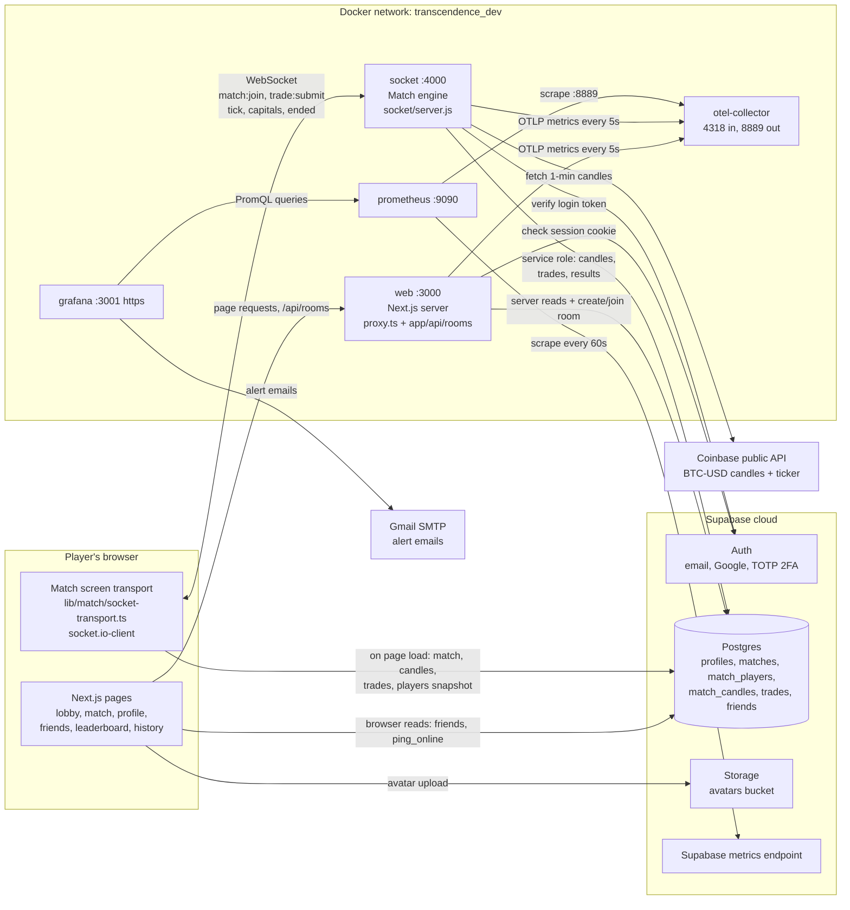
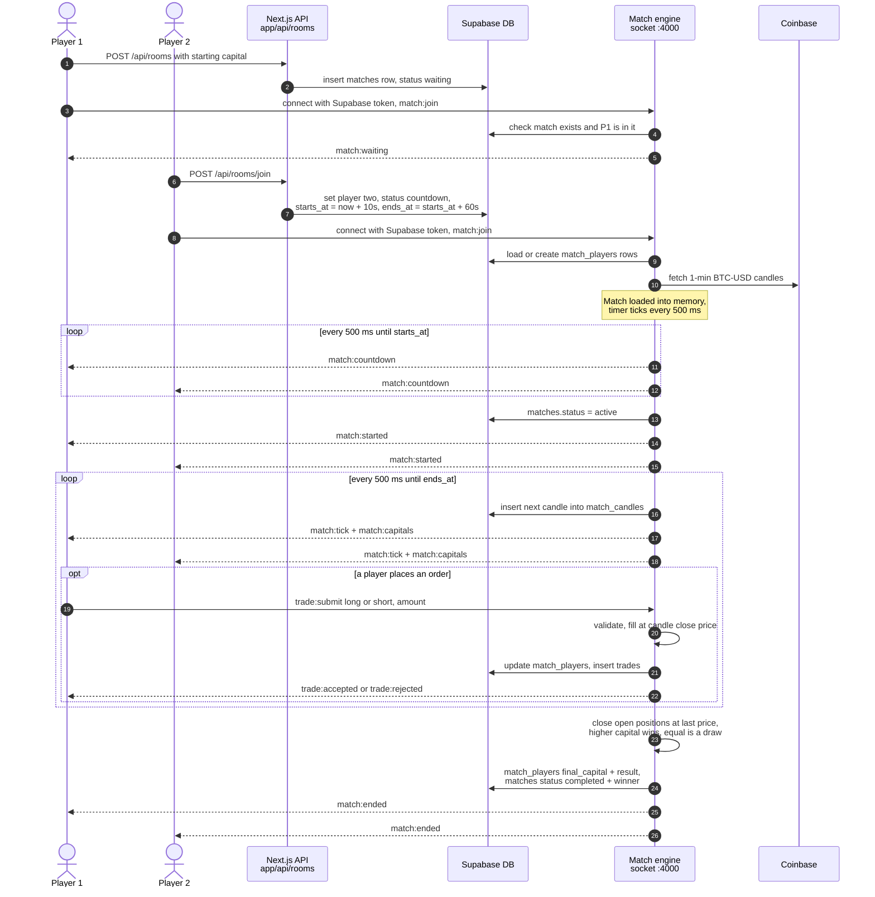
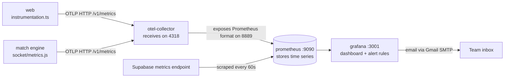

# How DUEL works

Three diagrams:

1. **System overview**: every service and what data flows between them.
2. **Match lifecycle**: a full game, from creating a room to the result.
3. **Monitoring pipeline**: how metrics get from the app to Grafana and email alerts.

## 1. System overview

**Who is in charge of what:**

- **Supabase** is the permanent memory: accounts, rooms/matches, trades, candles, results.
- **The match engine** is the referee. It keeps live matches in memory (`liveMatches`), decides every fill and the winner, then saves everything to Supabase. The browser only *shows* estimated numbers.
- **The web server** handles login redirects (`proxy.ts`) and room create/join (`app/api/rooms`). Most other pages read Supabase directly.
- When the engine starts, it runs `closeStaleMatches()`, which marks as completed any matches whose time has run out and any rooms that have waited for more than 1 hour.

## 2. Match lifecycle

**Notes:**

- The candles are **replayed history**, not a live feed. The engine grabs past 1-minute candles from Coinbase and sends one every 500 ms. It only uses the live ticker price if the candles fail to load.
- If a player refreshes the page, the browser reloads the snapshot (candles, trades, positions) from Supabase and then rejoins the socket room. The engine keeps a finished match in memory for 60 s so a reconnecting player still gets the result. After that, the result comes from the database.
- Opponents never see each other's trades, only each other's capital (`match:capitals`).

## 3. Monitoring pipeline

**Game metrics** sent by the engine (`socket/metrics.js`):

| Metric | Meaning |
| --- | --- |
| `transcendence_games_started_total` | matches that reached the trading phase |
| `transcendence_games_completed_total` | matches that finished |
| `transcendence_matches_played_total` | matches played |
| `transcendence_active_games` | matches running right now |

**Grafana alert rules** (`monitoring/grafana/provisioning/alerting/rules.yaml`):

| Alert | Watches |
| --- | --- |
| Database is down | `up{job="supabase"}` |
| OTel collector not reachable | `up{job="otel-collector"}` |
| Active game stuck | `transcendence_active_games` |
