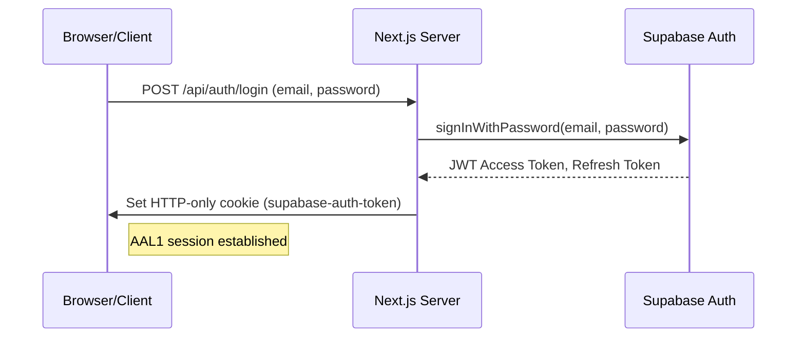
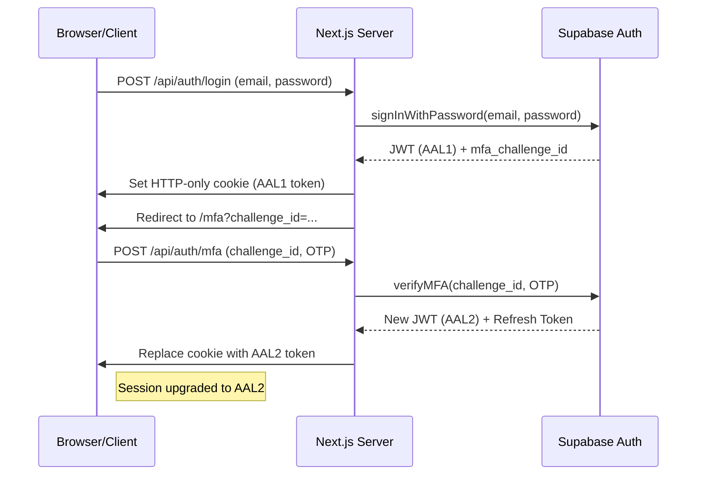
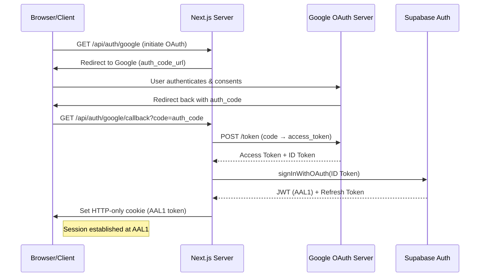
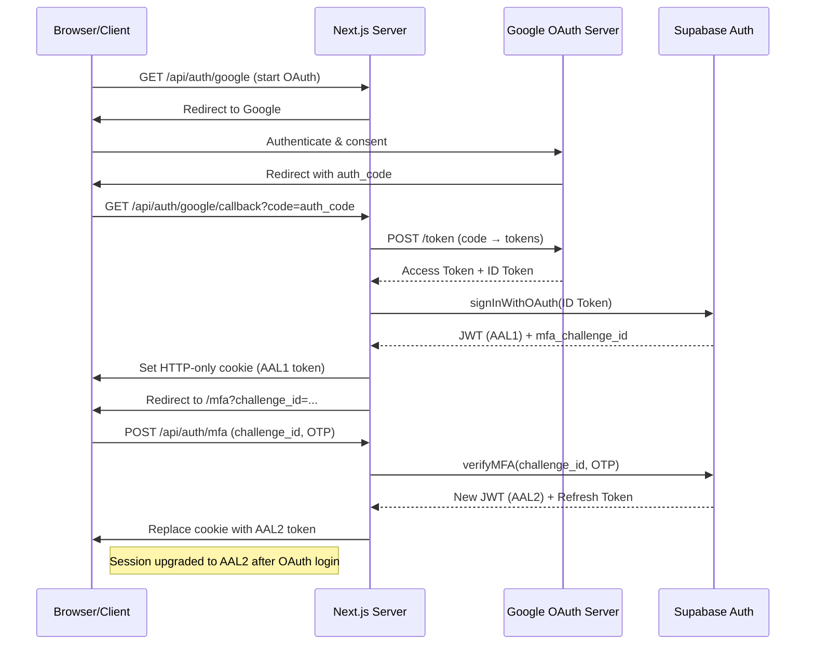

# Authentication Flow Diagrams

## 1. Email/Password Sign‑In (No 2FA – AAL1 Session)

The flow issues a standard AAL1 session using email/password credentials without additional verification.

---

## 2. Email/Password Sign‑In (With 2FA – Upgrade to AAL2)

After initial credential verification, the user completes an MFA challenge, resulting in an upgraded AAL2 session.

---

## 3. Google OAuth Sign‑In (No 2FA – AAL1 Session)

The Next.js callback exchanges the Google authorization code for tokens and creates an AAL1 Supabase session.

---

## 4. Google OAuth Sign‑In (With 2FA – Upgrade to AAL2)

When the OAuth‑generated session is AAL1 but the user requires MFA, the flow redirects to an MFA step and upgrades to an AAL2 session.
