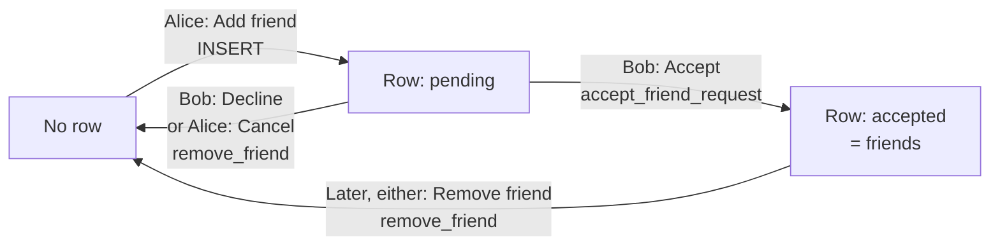
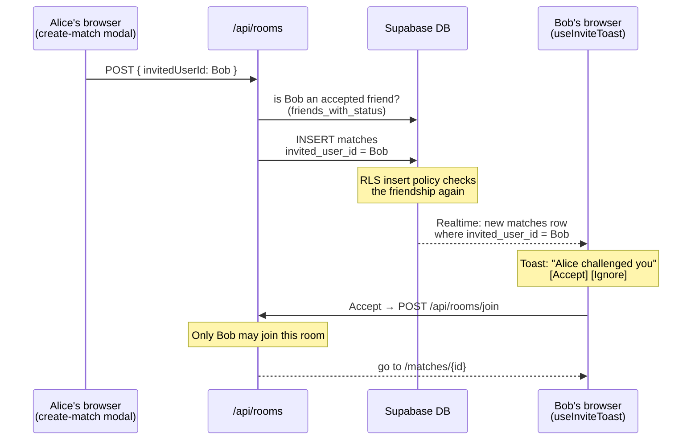

# How friends work

These pieces make up the friends feature:

- **`friends` table**: stores the friend requests and friendships (one row per pair of players).
- **`user_presence` table**: when each player was last online. Only the player and their accepted friends can read it.
- **`friends_with_status` view**: a saved query over `friends` + `profiles` + `user_presence`. It stores no data of its own; the friends page reads from it so it gets everything in one call.
- **`matches.invited_user_id` column**: turns a room into a private invite for one friend.

SQL:

- [`0002_friend_requests.sql`](../supabase/migrations/0002_friend_requests.sql): requests, accept / remove, the view
- [`0009_protect_profiles_presence_created_at.sql`](../supabase/migrations/0009_protect_profiles_presence_created_at.sql): moves `last_seen_at` into `user_presence` (friends only)
- [`0011_friend_invites.sql`](../supabase/migrations/0011_friend_invites.sql): private rooms for one friend

## 1. Friend requests

The boxes are what the row looks like; the arrows are the buttons that change it.

- `user_id` is the person who sent the request, and `friend_id` is the person who was asked.
- **Sending:** the insert policy only lets you send as yourself, never to yourself, and only as `pending`. There are two ways to send: the "Add friend" button on the match result screen, or the search box at the top of the friends page.
- **The search box** (`AddByUsername` in [`app/friends/page.tsx`](../app/friends/page.tsx)) looks up the exact username in `profiles`. It is case-sensitive, because "Bob" and "bob" can be two different players. It tells you if the player doesn't exist, if it's you, or if you're already friends / a request is already waiting (the unique index below rejects the insert with error `23505`).
- **Accepting:** there is no update policy, so the only way to accept is the `accept_friend_request` function, and it only accepts requests sent *to* you.
- **Removing:** decline, cancel and unfriend all mean "delete the row between us", so they share `remove_friend`.
- **Only one row per pair:** the `friends_one_row_per_pair` unique index stops Alice→Bob and Bob→Alice from both existing.

## 2. Online status

There is no "online" column. Each open tab keeps updating a timestamp in `user_presence`, and the friends page checks how old that timestamp is.

- The ping code is in [`app/components/duel/use-online-ping.ts`](../app/components/duel/use-online-ping.ts), and the 10-second online window is `ONLINE_WINDOW_SECONDS` in [`app/friends/page.tsx`](../app/friends/page.tsx).
- **Going offline needs no signal.** When the tab closes or is hidden, the pings stop, and after about 10 seconds the player shows as offline.
- The view uses `security_invoker = true`, so the `friends` read policy still applies: you only ever see rows you are part of.
- **Online status is for accepted friends only.** The `user_presence` read policy only returns your own row and your accepted friends' rows. While a request is still pending, `seconds_since_seen` is `null`, so that player shows as "Never seen online" until they accept.

## 3. Inviting a friend to a private match

When you create a match, the "Play with" dropdown lists your accepted friends. Picking one saves their id in `matches.invited_user_id`. Leaving it on "Anyone" keeps it `null`, which is a normal public room.

- **Who can see the room:** the `read_waiting_matches` policy shows waiting rooms only if they are public (`invited_user_id is null`) or were made for you. The creator sees it through "Players can view their matches". Nobody else sees it in the lobby.
- **Who can create one:** the insert policy only accepts an `invited_user_id` that is one of your accepted friends, so nobody can skip the API and send invites to strangers. `/api/rooms` checks the same thing first so it can show a clear error.
- **Who can join:** `/api/rooms/join` refuses anyone other than the invited friend ("This room is for someone else.").
- **The pop-up:** `matches` is in the `supabase_realtime` publication, and [`use-invite-toast.tsx`](../app/components/duel/use-invite-toast.tsx) (mounted in the side nav, so it works on every page) listens for new rows with `invited_user_id` = me. Realtime still applies the read policy, so you only hear about rooms made for you. The toast stays until you click Accept or Ignore. Ignore just closes it: the room stays open in the lobby for you.
