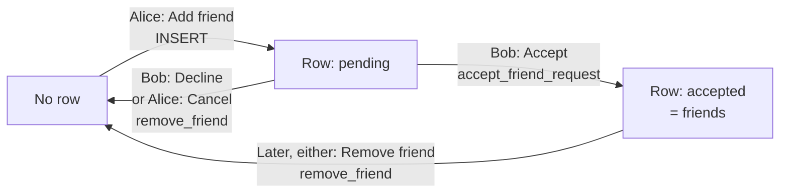
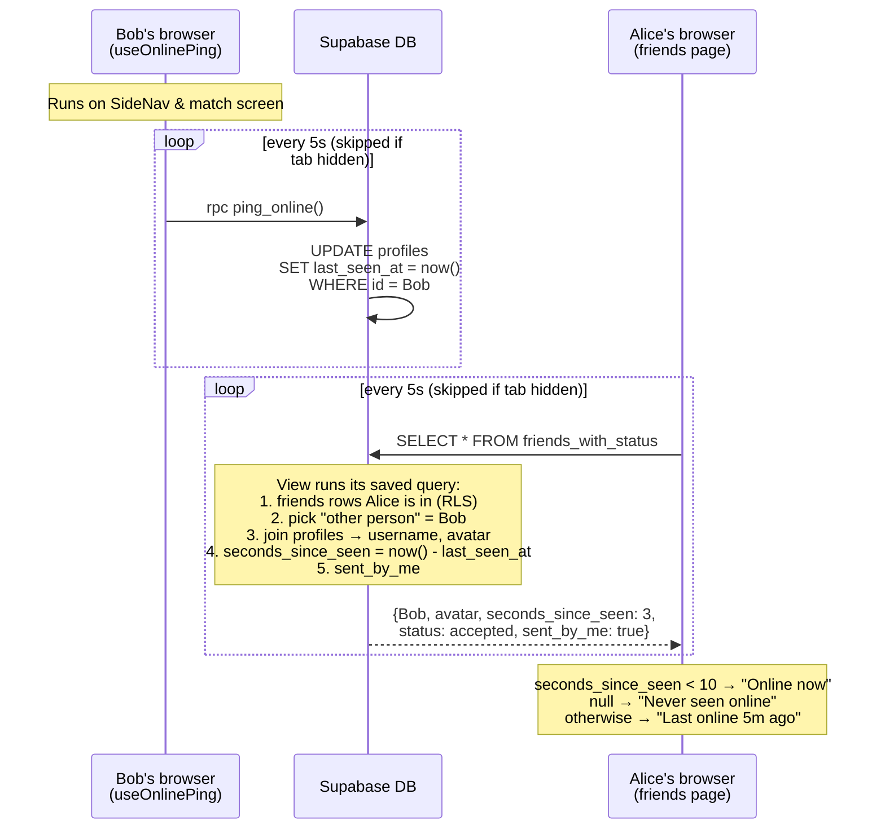

# How friends work

Two pieces make up the friends feature:

- **`friends` table**: stores the friend requests and friendships (one row per pair of players).
- **`friends_with_status` view**: a saved query over `friends` + `profiles`. It stores no data of its own; the friends page reads from it so it gets everything in one call.

SQL: [`supabase/migrations/0002_friend_requests.sql`](../supabase/migrations/0002_friend_requests.sql)

## 1. Friend requests

The boxes are what the row looks like; the arrows are the buttons that change it.

- `user_id` is the person who sent the request, and `friend_id` is the person who was asked.
- **Sending:** the insert policy only lets you send as yourself, never to yourself, and only as `pending`. There are two ways to send: the "Add friend" button on the match result screen, or typing an exact (case-sensitive) username at the top of the friends page.
- **Accepting:** there is no update policy, so the only way to accept is the `accept_friend_request` function, and it only accepts requests sent *to* you.
- **Removing:** decline, cancel and unfriend all mean "delete the row between us", so they share `remove_friend`.
- **Only one row per pair:** the `friends_one_row_per_pair` unique index stops Alice→Bob and Bob→Alice from both existing.

## 2. Online status

There is no "online" column. Each open tab keeps updating a timestamp, and the friends page checks how old that timestamp is.

- The ping code is in [`app/components/duel/use-online-ping.ts`](../app/components/duel/use-online-ping.ts), and the 10-second online window is `ONLINE_WINDOW_SECONDS` in [`app/friends/page.tsx`](../app/friends/page.tsx).
- **Going offline needs no signal.** When the tab closes or is hidden, the pings stop, and after about 10 seconds the player shows as offline.
- The view uses `security_invoker = true`, so the `friends` read policy still applies: you only ever see rows you are part of.
